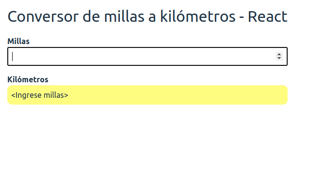

[](https://github.com/uqbar-project/eg-conversor-react/actions/workflows/build.yml) [](https://codecov.io/gh/uqbar-project/eg-conversor-react)

# Conversor ReactJS



## Variante con hooks

Para tener el conversor necesitamos definir:

- el estado: lo que queremos modificar (las millas)
- vs. lo que se puede calcular (los kilómetros en este caso, pero también el color del badge si hay un error en la conversión)

```jsx
const App = () => {
  const [millas, setMillas] = useState(INITIAL_VALUE)

  const millasConvertido = +millas
  const kilometros = millas === INITIAL_VALUE ? '<Ingrese millas>' : convertirMillasAKms(millasConvertido)
  const colorConversion = millas === INITIAL_VALUE ? 'warning' : 'success'

  return (
    <div className="App">
        <div className="header">
          Conversor de millas a kilómetros - React
        </div>
        <div className="form">
          <div className="row">
            <label>Millas</label>
            <input type="number" value={millas} name="millas" autoComplete="off" data-testid="millas" onChange={(event) => setMillas(event.target.value)} />
          </div>
          <div className="row">
            <label>Kilómetros</label>
            <div className={colorConversion}>
              <span data-testid="kms">{kilometros.toLocaleString('es')}</span>
            </div>
          </div>
        </div>
    </div>
  )
}
```

App está definida como una _lambda_, y trabajamos el estado mediante un **hook**:

```js
  const [millas, setMillas] = useState(INITIAL_VALUE)
```

Como bien explica [la documentación oficial de React](https://es.reactjs.org/docs/hooks-overview.html), el hook `useState`

- recibe como input un valor inicial
- y devuelve un par en forma de lista: el valor del estado actual y una función que permite actualizar el nuevo valor

Esto significa que dentro de la función App, podemos obtener el valor de las millas con la referencia `millas` para convertirlo a kilómetros. Y cuando el usuario escriba un valor nuevo en el input, eso debe actualizar el estado mediante la invocación a la función `setMillas`. Como consecuencia,

- nos concentramos solo en la parte del estado que queremos cambiar
- nuestro componente puede seguir siendo funcional, por lo tanto se concentra solo en la parte **presentacional** (cómo muestra la información al usuario)

En definitiva, un componente React puede ser visto como una función, como en este ejemplo, o como una clase. Si te interesa ver el segundo approach, podés ver [este ejemplo](https://legacy.reactjs.org/docs/react-component.html) o bien [la documentación oficial de React](https://react.dev/reference/react/Component).
