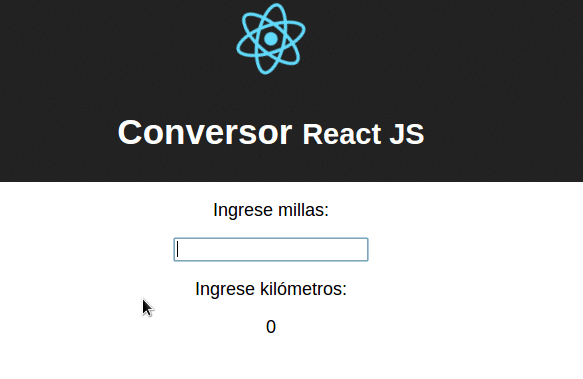
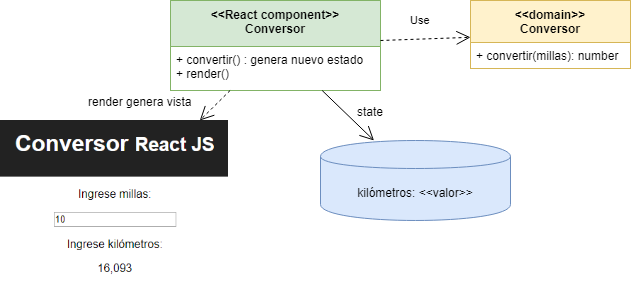
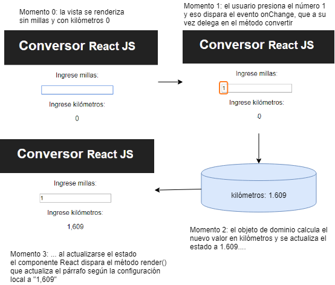
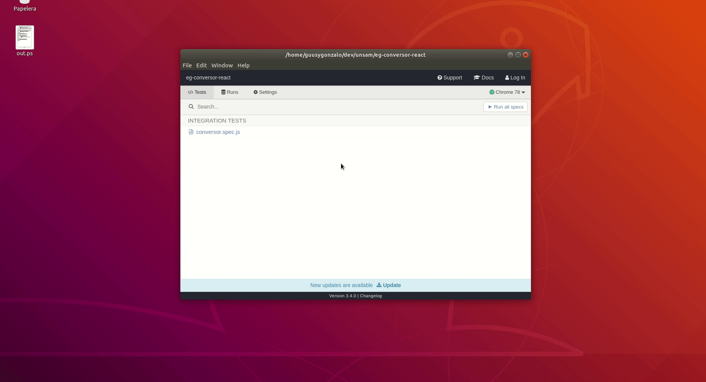

# Conversor ReactJS



Este proyecto fue generado con el script [Create React App](https://github.com/facebookincubator/create-react-app).

## Arquitectura general



El dominio es un objeto que recibe un número que representa las millas y devuelve su valor convertido a kilómetros. No tiene variables de instancia. Se puede ver en el archivo _conversor.js_ del directorio src:

```javascript
export default class Conversor {
    convertir(millas) {
        return millas * 1.60934
    }
}
```

La vista tiene 

- como estado una sola clave: "kilometros" que apunta al valor convertido.
- un input type text cuyo evento onChange dispara la conversión
- al convertir se actualiza el state del componente generando un nuevo conversor y llamando al convertir. El valor resultante va a parar a la única variable kilometros.

Esto puede verse en el archivo _App.js_ del directorio src:

```javascript
class App extends Component {
  constructor() {
    super()
    this.state = { kilometros: "<Ingrese millas>" }
    this.convertir = this.convertir.bind(this)
  }
  
  convertir(event) {
    this.setState({
      kilometros: new Conversor().convertir(event.target.value)
    })
  }

  render() {
    return (
      <div className="App">
        <div className="App-header">
          
          <h1>Conversor <small>React JS</small></h1>
        </div>
        <p>Ingrese millas:</p>
        <input type="text" name="millas" id="millas" onChange={this.convertir} />
        <p>Ingrese kilómetros:</p>
        <p id="kms">{this.state.kilometros.toLocaleString('es')}</p>
      </div>
    );
  }
}
```

## Entendiendo el binding de eventos

En [este articulo](https://reactkungfu.com/2015/07/why-and-how-to-bind-methods-in-your-react-component-classes/) se explica que cuando definimos una función en Javascript, la variable `this` se refiere al contexto de ejecución de dicha función:

```js
// esto se puede ejecutar en cualquier browser
let frog = {
  RUN_SOUND: "POP!!",
  run: function() { 
    console.log('this es ', this)
    return this.RUN_SOUND
  }
}
```

Si `frog` es un objeto, y vemos `run()` como un método de dicho objeto, lo natural es que pensemos en enviar el mensaje de la siguiente manera:

```js
> frog.run() 
this es  {RUN_SOUND: "POP!!", run: ƒ}
"POP!!"
```

Pero ECMAScript es también un lenguaje funcional, entonces puedo definir una variable y construir una función a partir del método definido en `frog`:

```js
> const f = frog.run
```

Ojo que al no pasarle paréntesis, no estamos invocando a la función, sino referenciando con la variable f a la función `frog.run`, que no recibe parámetros y devuelve un string.

Cuando invocamos a f, nuestra sorpresa:

```js
> f()
this es  Window {postMessage: ƒ, blur: ƒ, focus: ƒ, close: ƒ, frames: Window, …}
undefined
```

La variable `this` no está ligada a `frog`, sino a `window` (nuestro browser). Al extraer `f` como variable separada del objeto `frog`, perdimos el contexto de ejecución de this. Para poder recuperarlo, necesitamos la función bind:

```js
> const fParaFrog = f.bind(frog)
> fParaFrog()
this es  {RUN_SOUND: "POP!!", run: ƒ}
"POP!!"
// o bien...
> f.bind(frog)() // ...que produce el mismo resultado
```

Por ese motivo, queremos que al invocar a convertir las millas en kilómetros, `this` referencie a nuestro componente React y no a window. Entonces aplicamos el bind en el constructor:

```js
class App extends Component {
  constructor() {
    ...
    this.convertir = this.convertir.bind(this)
  }
```

Por qué lo hacemos? Porque en la función render asociamos el evento onChange a la referencia `convertir` de nuestra App, que de otra forma sería una función sin contexto asociado:

```js
  <input type="text" name="millas" id="millas" onChange={this.convertir} />
```

Otros artículos que recomendamos leer:

- [por qué debemos utilizar bind en eventos de ReactJS](https://medium.freecodecamp.org/this-is-why-we-need-to-bind-event-handlers-in-class-components-in-react-f7ea1a6f93eb)
- [la documentación oficial de la función bind](https://developer.mozilla.org/en-US/docs/Web/JavaScript/Reference/Global_objects/Function/bind)
- [5 formas de definir el binding](https://medium.freecodecamp.org/react-binding-patterns-5-approaches-for-handling-this-92c651b5af56)

## Ciclo de vida



# Testing

Para testear el componente probamos

- que la aplicación levanta correctamente
- que inicialmente el valor en kilómetros dice `"<Ingrese millas>"`
- que al escribir el valor "10" en millas eso convierte a "16.093"

Dado que estaremos usando los _mocks_ de Enzyme, no se convierte el punto decimal a coma.

Vemos los tests en el archivo _App.test.js_ del directorio src:

```javascript
it('App levanta', () => {
  shallow(<App />)
})
it('convertir 10 millas a kilómetros', () => {
  const wrapper = shallow(<App/>)
  const kms = wrapper.find('#kms')
  expect(kms.text()).toBe('<Ingrese millas>')
})
it('convertir 10 millas a kilómetros', () => {
  const wrapper = shallow(<App/>)
  const millas = wrapper.find('#millas')
  millas.simulate('change', { 'target': { value: '10'}})
  const kms = wrapper.find('#kms')
  expect(kms.text()).toBe("16.093")
})
```

# Variante funcionalosa

Aquí vemos que el objeto Conversor no tiene estado, nuestra primera alternativa será convertirlo en una función:

```js
export default function convertir(millas) {
    return millas * 1.60934
}
```

El componente principal React lo importa como una función y la invoca (no hay objeto receptor), lo que sigue cambiando el estado del componente:

```js
  convertir(newMillas) {
    this.setState({kilometros: convertir(newMillas)})
  }
```

Y como variante, en lugar de bindear `this` vamos a utilizar una lambda en el render:

```jsx
  onChange={(event) => this.convertir(event.target.value)}/>
```

Esto permite que el método ya no reciba el misterioso `event` sino un nombre más representativo: `newMillas`.

# Cypress :tada: :tada: :tada: 

## Que es ? 

[Cypress](https://www.cypress.io) en un framework de test e2e, para testear aplicaciones que corren en un navegador.

### ¿Y pero esto no es lo mismo que los test unitarios con jest ? :thinking: :thinking: :thinking: 

No ! la diferencia que tenemos con los test unitarios, es que estos solo testean los componentes por separado, en cambio acá nosotros levantamos un navegador y podemos testear cómo interactúan nuestros componentes entre si, solo guiándonos por el HTML de nuestro sitio.

## Instalación :hammer_and_wrench: 

Tal cual nos explica en el [get-started](https://docs.cypress.io/guides/getting-started/installing-cypress.html#npm-install), instalamos la dependencia de cypress

```bash
npm install cypress --save-dev
```

Ahora le decimos a cypress que nos cree los archivos necesarios para comenzar a testear, tal como dice en la web podemos usar algunos de estos comandos

```bash
./node_modules/.bin/cypress open
```

```
(npm bin)/cypress open
```

O bien si tenemos npx (que se encuentra en la versión de npm `5.2` hacia delante)

```bash
npx cypress open
```

Si es la primera vez que corremos el proyecto, nos va a crear un montón de ejemplos de cómo testear, en caso contrario nos va abre el ambiente de desarrollo de cypress que tiene la siguiente pinta:



En la primera pantalla nos muestra los archivos de tests que escribimos, los clickeamos y abre un navegador y empieza a correr nuestros tests. Pero ojo ! tenemos que tener nuestra aplicación levantada para poder correr los tests

¿Y como se hace eso ?

```bash
npm run start
```

Una vez levantado podemos correr el comando `open` de cypress, pero antes debemos modificar el archivo *cypress.json* para que la url base de los tests sea `localhost:3000` (puerto en el cual levantamos nuestra app).

```json
{
    "baseUrl": "http://localhost:3000",
    "video": false
}
```

ponemos `video` en `false` para que no grabe los tests 

### Y como se escribe un test ? 

Fácil ! vamos a seguir usando los `describe` y `it` de jest y los hooks cómo  `before, beforeAll, beforeEach` , solo que ahora utilizaremos el objeto `cy` que nos va a permitir testear

```javascript
/// <reference types="Cypress" />

const MILLAS_SELECTOR = '[data-testid=millas]'
const KMS_SELECTOR = '[data-testid=kms]'
const ERROR_SELECTOR = '[data-testid=error]'

describe('Caso feliz', () => {
  before(() => {
    cy.visit('/')
  })
  it('escribimos un numero positivo de millas a convertir', () => {
    cy.get(MILLAS_SELECTOR)
      .type(10).should('have.value', '10')
  })
  it('y se tranforma a kilometros', () => {
    cy.get(KMS_SELECTOR).contains('16,093')
  })

})
describe('Caso 0', () => {
  before(() => {
    cy.visit('/')
  })
  it('escribimos 0 en las millas a convertir', () => {
    cy.get(MILLAS_SELECTOR)
      .type(0).should('have.value', '0')
  })
  it('y en los kilometros vemos 0', () => {
    cy.get(KMS_SELECTOR).contains('0')
  })

})
describe('Caso alfabetico', () => {
  before(() => {
    cy.visit('/')
  })
  it('escribimos un valor que no es un numero en el input', () => {
    cy.get(MILLAS_SELECTOR)
      .type('1.*-*/*').should('have.value', '1.*-*/*')
  })
  it('y aparece un cartel de error avisandonos que no es un input valido', () => {
    cy.get(ERROR_SELECTOR)
  })

})

```

Separamos los describes por *flujos* de nuestra aplicación y hacemos uso de `data-testid` para no acoplarnos a los atributos de html.
usamos `/// <reference types="Cypress" />` a comienzo de nuestro archivo de tests, para ayudar a nuestro IDE con la sugerencias sobre las funcionalidades de cypress.

La funciones que usamos de cypress son  :

`cy.visit` => para visitar una url de nuestra aplicación

`cy.get` => obtenemos un elemento del DOM en base a un selector

`cy.type` => escribimos en un input


## Y travis ? :construction_worker_man: 

Bueno cypress en su [pagina](https://docs.cypress.io/guides/guides/continuous-integration.html#Setting-up-CI) nos comenta cómo integrar con nuestro CI de turno, estos test e2e.

Nosotros nos basamos en [este](https://github.com/cypress-io/cypress-example-kitchensink/blob/master/.travis.yml) archivo para crear el nuestro, borrando codigo redudante y demas.

Pero como vimos antes, tenemos que tener la aplicación corriendo para poder testearla.... y cómo hacemos eso en CI ?

Fácil, creamos dentro de nuestro package.json los siguientes comandos:

```json
{
  "start": "react-scripts start",
  "start:ci": "npm start & wait-on http://localhost:3000",
  "cy:run": "cypress run",
  "cy:verify": "cypress verify",
}
```

Ya que dentro de travis utilizamos los siguientes comandos:

```yaml
language: node_js

node_js:
  - 10.8

addons:
  apt:
    packages:
    - libgconf-2-4

cache:
  directories:
    - ~/.npm
    - ~/.cache
  override:
    - npm ci
    - npm run cy:verify

script:
  - npm run start:ci
  - npm run test
  - npm run cy:run
```

- `npm run start:ci` levanta nuestra aplicación y espera a que este completamente levantada para seguir al próximo paso (usamos una lib llamada wait-on para esperar)

- `npm run cy:run` corre nuestros tests

- `npm run cy:verify` chequea la instalación de travis en el ambiente

