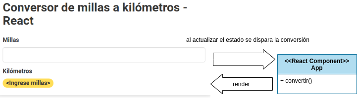
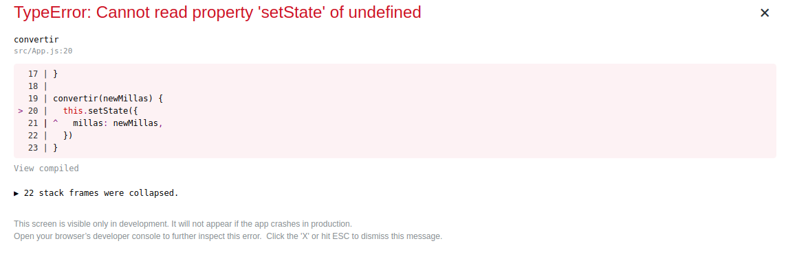

[](https://github.com/uqbar-project/eg-conversor-react/actions/workflows/build.yml) 

# Conversor ReactJS


Este proyecto fue generado con el script [Create React App](https://github.com/facebookincubator/create-react-app).

## Arquitectura general

### Dominio



El dominio podría ser 

- un objeto
- o bien podemos modelarlo simplemente con una función, que recibe las millas y lo convierte a kilómetros. Se puede ver en el archivo _conversor.js_ del directorio src:

```js
const FACTOR_CONVERSION = 1.60934

export const convertirMillasAKms = (millas) => millas * FACTOR_CONVERSION
```

### Vista

La vista tiene 

- como estados una sola clave: "millas" con el valor en millas
- temporalmente tomamos las millas del estado y hacemos la conversión a kilómetros, y definimos la clase "success" / "warning" en caso de que la conversión sea exitosa o no para ver el badge verde o amarillo, respectivamente.
- un input type text cuyo evento onChange dispara la conversión
- al convertir se actualiza el state del componente generando un nuevo valor para la variable `millas`.

Esto puede verse en el archivo _App.js_ del directorio src:

```javascript
class App extends Component {
  constructor() {
    super()
    this.state = {
      millas: INITIAL_VALUE,
    }
  }

  actualizarMillas(newMillas) {
    this.setState({
      millas: newMillas,
    })
  }

  render() {
    const newMillas = this.state.millas
    const kilometros = newMillas === INITIAL_VALUE ? '<Ingrese millas>' : (isNaN(newMillas) ? '<Ingrese un valor numérico>' : convertirMillasAKms(newMillas))
    const colorConversion = newMillas === INITIAL_VALUE || isNaN(newMillas) ? 'warning' : 'success'

    return (
      <div className="App">
        <Box>
          <Heading>
            Conversor de millas a kilómetros - React
        </Heading>
          <Field>
            <Label>Millas</Label>
            <Control>
              <Input value={this.state.millas} name="millas" autoComplete="off" data-testid="millas" onChange={(event) => this.actualizarMillas(event.target.value)} />
            </Control>
          </Field>
          <Field>
            <Label>Kilómetros</Label>
            <Tag color={colorConversion} rounded>
              <Label data-testid="kms">{kilometros.toLocaleString('es')}</Label>
            </Tag>
          </Field>
        </Box>
      </div>
    )
  }
}
```

## Reaccionando ante un cambio en las millas

Nos detenemos en la definición del evento onChange para el input de millas:

```jsx
onChange={(event) => this.actualizarMillas(event.target.value)}
```

Definir una expresión lambda (_arrow function_) permite que la referencia `this` esté apuntando al componente React que estamos escribiendo. Podríamos pensar que una definición similar podría ser:

```jsx
onChange={this.actualizarMillas}
```

Y modificar el método actualizarMillas para adaptar el valor recibido:

```js
  actualizarMillas(event) {
    const newMillas = event.target.value
    this.setState({
      ...
```

Pero ojo que podemos llevarnos algunas sorpresas...



## Entendiendo el binding de eventos

En [este articulo](https://reactkungfu.com/2015/07/why-and-how-to-bind-methods-in-your-react-component-classes/) se explica que cuando definimos una función en Javascript, la variable `this` se refiere al contexto de ejecución de dicha función:

```js
// esto se puede ejecutar en cualquier browser
const frog = {
  RUN_SOUND: "POP!!",
  run: function() { 
    console.log('this es ', this)
    return this.RUN_SOUND
  }
}
```

Si `frog` es un objeto, y vemos `run()` como un método de dicho objeto, lo natural es que pensemos en enviar el mensaje de la siguiente manera:

```js
> frog.run() 
this es  {RUN_SOUND: "POP!!", run: ƒ}
"POP!!"
```

Pero ECMAScript es también un lenguaje funcional, entonces puedo definir una variable y construir una función a partir del método definido en `frog`:

```js
> const f = frog.run
```

Ojo que al no pasarle paréntesis, no estamos invocando a la función, sino referenciando con la variable f a la función `frog.run`, que no recibe parámetros y devuelve un string.

Cuando invocamos a f, nuestra sorpresa:

```js
> f()
this es  Window {postMessage: ƒ, blur: ƒ, focus: ƒ, close: ƒ, frames: Window, …}
undefined
```

La variable `this` no está ligada a `frog`, sino a `window` (nuestro browser). Al extraer `f` como variable separada del objeto `frog`, perdimos el contexto de ejecución de this. Para poder recuperarlo, necesitamos la función bind:

```js
> const fParaFrog = f.bind(frog)
> fParaFrog()
this es  {RUN_SOUND: "POP!!", run: ƒ}
"POP!!"
// o bien...
> f.bind(frog)() // ...que produce el mismo resultado
```

Por ese motivo, queremos que al invocar a actualizarMillas, `this` referencie a nuestro componente React y no a window. Entonces aplicamos el bind en el constructor:

```js
class App extends Component {
  constructor() {
    ...
    this.actualizarMillas = this.actualizarMillas.bind(this)
  }
```

¿Por qué lo hacemos? Porque en la función render asociamos el evento onChange a la referencia `actualizarMillas` de nuestra App, que de otra forma sería una función sin contexto asociado:

```js
  <input type="text" name="millas" id="millas" onChange={this.actualizarMillas} />
```

Otros artículos que recomendamos leer:

- [por qué debemos utilizar bind en eventos de ReactJS](https://medium.freecodecamp.org/this-is-why-we-need-to-bind-event-handlers-in-class-components-in-react-f7ea1a6f93eb)
- [la documentación oficial de la función bind](https://developer.mozilla.org/en-US/docs/Web/JavaScript/Reference/Global_objects/Function/bind)
- [5 formas de definir el binding](https://medium.freecodecamp.org/react-binding-patterns-5-approaches-for-handling-this-92c651b5af56)

> A partir de aquí, dejamos que establezcas tu propio criterio para elegir una opción u otra.

## Ciclo de vida

Para entender el ciclo de vida

1. render inicial
2. el usuario escribe un 1
3. onChange dispara un nuevo setState con el objeto `{ "millas": "1" }`
4. se ejecuta un nuevo render, con la conversión a kilómetros
5. el usuario escribe un 2, 
6. onChange dispara un nuevo setState con el objeto `{ "millas": "12" }`
7. se ejecuta un nuevo render, con la conversión a kilómetros...

pueden escribir un `console.log` en cada evento.

# Testing

Para testear el componente probamos

- que inicialmente el valor en kilómetros dice `"<Ingrese millas>"`
- que si escribimos un valor alfabético el valor en kilómetros mostrará el error `"<Ingrese un valor numérico>"`
- que al escribir el valor "10" en millas eso convierte a "16.093"

Resolvemos los tests unitarios utilizando el framework React Testing Library (que reemplaza a Enzyme para las versiones recientes de create-react-app)

```js
test('convierte un valor > 0 de millas a kilómetros correctamente', async () => {
  const { getByTestId } = render(<App />)
  // El usuario carga 10 en millas
  const inputMillas = getByTestId('millas')
  fireEvent.change(inputMillas, { target: { value: '10' } })
  // https://stackoverflow.com/questions/52618569/set-the-locale-for-date-prototype-tolocalestring-for-jest-tests
  expect(getByTestId('kms')).toHaveTextContent('16,093')
})

test('inicialmente pide que convirtamos de millas a kilómetros', async () => {
  const { getByTestId } = render(<App />)
  expect(getByTestId('kms')).toHaveTextContent('<Ingrese millas>')
})

test('si ingresa un valor alfabético la conversión de millas a kilómetros no se realiza', async () => {
  const { getByTestId } = render(<App />)
  const inputMillas = getByTestId('millas')
  // El usuario carga 'dos' en millas, otra variante más declarativa
  userEvent.type(inputMillas, 'dos')
  expect(getByTestId('kms')).toHaveTextContent('<Ingrese un valor numérico>')
})
```

## Customizaciones

### Font

El font-family lo configuramos en el archivo `src/App.css`

```css
body {
  font-family: 'Noto Sans JP', sans-serif;
}
```

Y dentro de la carpeta `public` del raíz de este proyecto, vas a encontrar el `index.html` donde tenés que referenciar al typeface:

```html
  <link href="https://fonts.googleapis.com/css2?family=Noto+Sans+JP&display=swap" rel="stylesheet">
```

### Favicon

En la carpeta `public` también se ubica el `favicon.ico` que podés generar a partir de un png con varios programas online, como https://convertico.com/

### react-bulma-components

Para definir los estilos de la página utilizamos los componentes definidos por React Bulma Components:

- [Página de inicio](https://github.com/couds/react-bulma-components)
- [Storybook](https://couds.github.io/react-bulma-components/?path=/story)

> **Nota importante**: estamos usando la versión 3.4.0 ya que de la 4 en adelante no está generado correctamente el build y no funciona.
