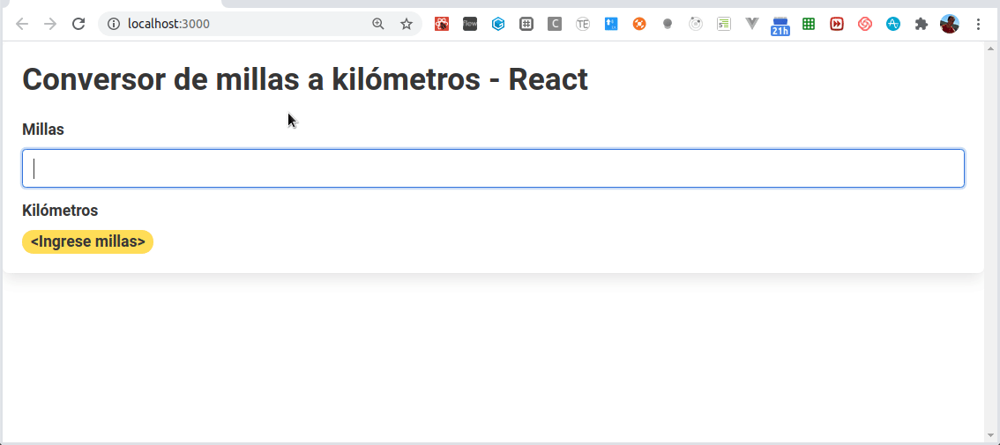
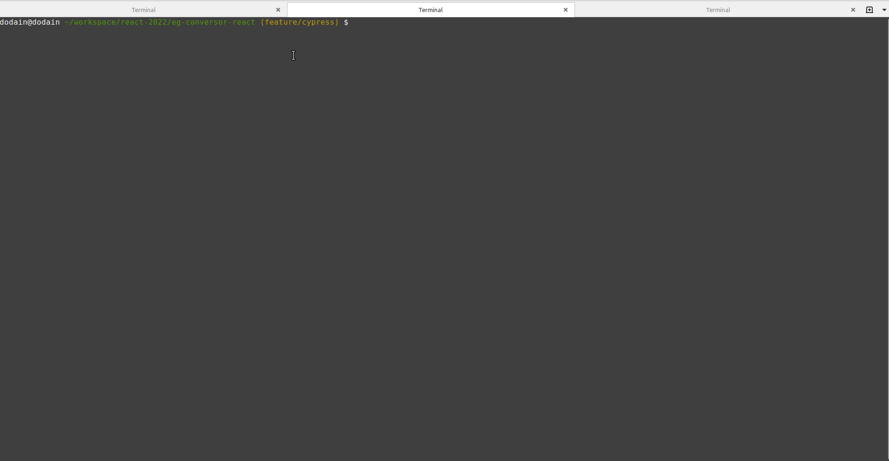

[](https://github.com/uqbar-project/eg-conversor-react/actions/workflows/build.yml) 


# Conversor ReactJS

Si estás buscando la explicación original podés encontrarla en el branch [master](https://github.com/uqbar-project/eg-conversor-react).



[Cypress](https://www.cypress.io) en un framework de test e2e, para testear aplicaciones que corren en un navegador.

### ¿Y pero ésto no es lo mismo que los test unitarios con jest? :thinking: :thinking: :thinking: 

¡No! la diferencia que tenemos con los test unitarios, es que estos solo testean los componentes por separado, en cambio acá nosotros levantamos un navegador y podemos testear cómo interactúan nuestros componentes entre sí, solo guiándonos por el HTML de nuestro sitio.

## Instalación :hammer_and_wrench: 

Tal cual nos explica en el [get-started](https://docs.cypress.io/guides/getting-started/installing-cypress.html#npm-install), instalamos la dependencia de cypress

```bash
npm install cypress --save-dev
```

Ahora le decimos a cypress que nos cree los archivos necesarios para comenzar a testear, tal como dice en la web podemos usar algunos de estos comandos

```bash
npx cypress open
```

Si es la primera vez que corremos el proyecto, nos va a crear un montón de ejemplos de cómo testear, en caso contrario nos va abre el ambiente de desarrollo de cypress que tiene la siguiente pinta:



En la primera pantalla nos muestra los archivos de tests que escribimos, los clickeamos y abre un navegador y empieza a correr nuestros tests. Pero ¡ojo! tenemos que tener nuestra aplicación levantada para poder correr los tests

¿Y cómo se hace eso ?

```bash
npm run start
```

Una vez levantado podemos correr el comando `open` de cypress, pero antes debemos modificar el archivo *cypress.config.js* para que la url base de los tests sea `localhost:3000` (puerto en el cual levantamos nuestra app).

```js
const { defineConfig } = require('cypress')

module.exports = defineConfig({
  video: false,
  e2e: {
    // We've imported your old cypress plugins here.
    // You may want to clean this up later by importing these.
    setupNodeEvents(on, config) {
      return require('./cypress/plugins/index.js')(on, config)
    },
    baseUrl: 'http://localhost:3000',
  },
})
```

ponemos `video` en `false` para que no grabe los tests 

### Cómo se escribe un test

Vamos a seguir usando los `describe` y `it` de jest y los hooks cómo  `before, beforeAll, beforeEach` , solo que ahora utilizaremos el objeto `cy` que nos va a permitir testear

```javascript
/// <reference types="Cypress" />

const MILLAS_SELECTOR = '[data-testid=millas]'
const KMS_SELECTOR = '[data-testid=kms]'
const ERROR_SELECTOR = '[data-testid=error]'

describe('Caso feliz', () => {
  before(() => {
    cy.visit('/')
  })
  it('escribimos un numero positivo de millas a convertir', () => {
    cy.get(MILLAS_SELECTOR)
      .type(10).should('have.value', '10')
  })
  it('y se tranforma a kilometros', () => {
    cy.get(KMS_SELECTOR).contains('16,093')
  })

})
describe('Caso 0', () => {
  before(() => {
    cy.visit('/')
  })
  it('escribimos 0 en las millas a convertir', () => {
    cy.get(MILLAS_SELECTOR)
      .type(0).should('have.value', '0')
  })
  it('y en los kilometros vemos 0', () => {
    cy.get(KMS_SELECTOR).contains('0')
  })

})
describe('Caso alfabetico', () => {
  before(() => {
    cy.visit('/')
  })
  it('escribimos un valor que no es un numero en el input', () => {
    cy.get(MILLAS_SELECTOR)
      .type('1.*-*/*').should('have.value', '1.*-*/*')
  })
  it('y aparece un cartel de error avisandonos que no es un input valido', () => {
    cy.get(ERROR_SELECTOR)
  })

})
```

Separamos los describes por *flujos* de nuestra aplicación y hacemos uso de `data-testid` para no acoplarnos a los atributos de html.

La línea `/// <reference types="Cypress" />` a comienzo de nuestro archivo de tests activa nuestro IDE para que utilice sugerencias sobre las funcionalidades de cypress.

La funciones que usamos de cypress son:

- `cy.visit` => para visitar una url de nuestra aplicación
- `cy.get` => obtenemos un elemento del DOM en base a un selector
- `cy.type` => escribimos en un input

## ¿Y Github Actions? :construction_worker_man: 

Bueno cypress en su [pagina](https://docs.cypress.io/guides/guides/continuous-integration.html#Setting-up-CI) nos comenta cómo integrar con nuestro CI de turno, estos test e2e.

Nosotros nos basamos en [este archivo](https://github.com/cypress-io/cypress-example-kitchensink/blob/master/.github/workflows/chrome-headless.yml) para crear el nuestro, borrando código redudante y demás yerbas.

Pero como hemos vimos antes,tenemos que tener la aplicación corriendo para poder testearla.... y ¿cómo hacemos eso en CI?

Fácil, creamos dentro de nuestro `package.json` los siguientes comandos:

```json
{
  "cy:open": "cypress open",
  "cy:run": "cypress run",
  "cy:ci": "start-server-and-test start 3000 cy:run",
  "cy:verify": "cypress verify",
}
```

- `npm run cy:ci` levanta nuestra aplicación y espera a que este completamente levantada para seguir al próximo paso (usamos una biblioteca llamada start-server-and-test para esperar)

para instalar `start-server-and-test` : `npm install wait-on -D`

- `yarn run cy:ci` corre nuestros tests en modo Continuous Integration
- `yarn run cy:verify` chequea la instalación de CI en el ambiente
