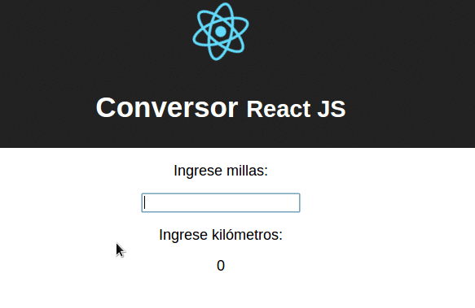
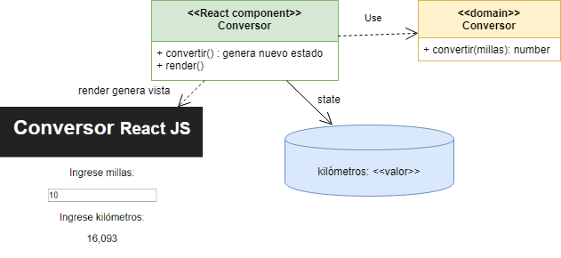
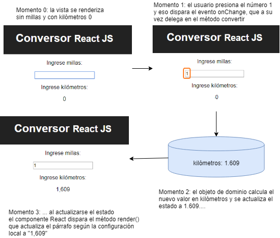
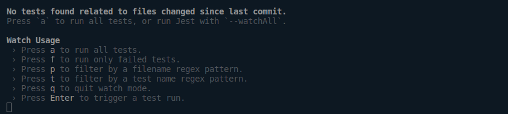

# Conversor ReactJS



Este proyecto fue generado con el script [Create React App](https://github.com/facebookincubator/create-react-app).

## Arquitectura general



El dominio es un objeto que recibe un número que representa las millas y devuelve su valor convertido a kilómetros. No tiene variables de instancia. Se puede ver en el archivo _conversor.js_ del directorio src:

```javascript
export default class Conversor {
    convertir(millas) {
        return millas * 1.60934
    }
}
```

La vista tiene 

- como estado una sola clave: "kilometros" que apunta al valor convertido.
- un input type text cuyo evento onChange dispara la conversión
- al convertir se actualiza el state del componente generando un nuevo conversor y llamando al convertir. El valor resultante va a parar a la única variable kilometros.

Esto puede verse en el archivo _App.js_ del directorio src:

```javascript
class App extends Component {
  constructor() {
    super()
    this.state = { kilometros: "<Ingrese millas>" }
    this.convertir = this.convertir.bind(this)
  }
  
  convertir(event) {
    this.setState({
      kilometros: new Conversor().convertir(event.target.value)
    })
  }

  render() {
    return (
      <div className="App">
        <div className="App-header">
          
          <h1>Conversor <small>React JS</small></h1>
        </div>
        <p>Ingrese millas:</p>
        <input type="text" name="millas" id="millas" onChange={this.convertir} />
        <p>Ingrese kilómetros:</p>
        <p id="kms">{this.state.kilometros.toLocaleString('es')}</p>
      </div>
    );
  }
}
```

## Entendiendo el binding de eventos

En [este articulo](https://reactkungfu.com/2015/07/why-and-how-to-bind-methods-in-your-react-component-classes/) se explica que cuando definimos una función en Javascript, la variable `this` se refiere al contexto de ejecución de dicha función:

```js
// esto se puede ejecutar en cualquier browser
let frog = {
  RUN_SOUND: "POP!!",
  run: function() { 
    console.log('this es ', this)
    return this.RUN_SOUND
  }
}
```

Si `frog` es un objeto, y vemos `run()` como un método de dicho objeto, lo natural es que pensemos en enviar el mensaje de la siguiente manera:

```js
> frog.run() 
this es  {RUN_SOUND: "POP!!", run: ƒ}
"POP!!"
```

Pero ECMAScript es también un lenguaje funcional, entonces puedo definir una variable y construir una función a partir del método definido en `frog`:

```js
> const f = frog.run
```

Ojo que al no pasarle paréntesis, no estamos invocando a la función, sino referenciando con la variable f a la función `frog.run`, que no recibe parámetros y devuelve un string.

Cuando invocamos a f, nuestra sorpresa:

```js
> f()
this es  Window {postMessage: ƒ, blur: ƒ, focus: ƒ, close: ƒ, frames: Window, …}
undefined
```

La variable `this` no está ligada a `frog`, sino a `window` (nuestro browser). Al extraer `f` como variable separada del objeto `frog`, perdimos el contexto de ejecución de this. Para poder recuperarlo, necesitamos la función bind:

```js
> const fParaFrog = f.bind(frog)
> fParaFrog()
this es  {RUN_SOUND: "POP!!", run: ƒ}
"POP!!"
// o bien...
> f.bind(frog)() // ...que produce el mismo resultado
```

Por ese motivo, queremos que al invocar a convertir las millas en kilómetros, `this` referencie a nuestro componente React y no a window. Entonces aplicamos el bind en el constructor:

```js
class App extends Component {
  constructor() {
    ...
    this.convertir = this.convertir.bind(this)
  }
```

Por qué lo hacemos? Porque en la función render asociamos el evento onChange a la referencia `convertir` de nuestra App, que de otra forma sería una función sin contexto asociado:

```js
        <input type="text" name="millas" id="millas" onChange={this.convertir} />
```

Otros artículos que recomendamos leer:

- [por qué debemos utilizar bind en eventos de ReactJS](https://medium.freecodecamp.org/this-is-why-we-need-to-bind-event-handlers-in-class-components-in-react-f7ea1a6f93eb)
- [la documentación oficial de la función bind](https://developer.mozilla.org/en-US/docs/Web/JavaScript/Reference/Global_objects/Function/bind)
- [5 formas de definir el binding](https://medium.freecodecamp.org/react-binding-patterns-5-approaches-for-handling-this-92c651b5af56)

## Ciclo de vida



# Testing

Para testear el componente probamos

- que la aplicación levanta correctamente
- que inicialmente el valor en kilómetros dice `"<Ingrese millas>"`
- que al escribir el valor "10" en millas eso convierte a "16.093"

Dado que estaremos usando los _mocks_ de Enzyme, no se convierte el punto decimal a coma.

Vemos los tests en el archivo _App.test.js_ del directorio src:

```javascript
it('App levanta', () => {
  shallow(<App />)
})
it('convertir 10 millas a kilómetros', () => {
  const wrapper = shallow(<App/>)
  const kms = wrapper.find('#kms')
  expect(kms.text()).toBe("<Ingrese millas>")
})
it('convertir 10 millas a kilómetros', () => {
  const wrapper = shallow(<App/>)
  const millas = wrapper.find('#millas')
  millas.simulate('change', { 'target': { value: '10'}})
  const kms = wrapper.find('#kms')
  expect(kms.text()).toBe("16.093")
})
```

# Husky :rocket:

## Que es ? :thinking: 
Husky es una [libreria](https://github.com/typicode/husky#readme) de npm, que nos permite definir procesos/comandos que queremos que corran antes de efectuar un comando de git, en caso de que el comando genere un error, el comando de git no se efectuara ! por ejemplo antes de pushear o commitear.

## Instalación

Debemos instalar esta dependencia de desarrollo, para eso corremos el siguiente comando:

```bash 
npm install husky --save-dev
```

Una vez terminado, agregamos en nuestro `package.json` una key llamada `husky` tal cual nos indica en la documentacion

```json
"husky": {
    "hooks": {
      "pre-commit": "echo 'que lindo commit !'",
      "pre-push": "echo 'Ya esta todo subido !!!!! '",
    }
}
```

Ahora gracias a esto cada vez que hagamos un commit nos va a decir `que lindo commit !` y cada vez que pushemos `Ya esta todo subido !!!!!`

### Ah... que bonito... y eso de que nos sirve ?

Ahora podriamos cambiar esos `echo` por un comando que corra nuestros test unitarios, de esta manera, nunca vamos a hacer un commit o push con tests rotos ! :tada:

```json
"husky": {
    "hooks": {
      "pre-commit": "npm test",
      "pre-push": "npm test",
    }
}
```

Si ahora intentamos commitear, gracias a que usamos jest y cada vez que corren los test, nos dispone una interfaz por consola. Se va a quedar trabado ahi y no vamos a poder commitear



Para fixear esto, al comando de jest se le puede pasar una variable `CI=true` que va a ser que no aparezca esta interfaz visual.

```json
"husky": {
    "hooks": {
      "pre-commit": "CI=true npm test",
      "pre-push": "CI=true npm test"
    }
}
```

### Que pasa si quiero commitear/pushear igualmente aunque este todo roto ? :eyes: 

Muy facil ! para poder hacer esto, lo que debemos hacer al commitear o pushear es agregar un `--no-verify` al final de nuestro comando

```
git commit -m "soy un commit con tests rotos" --no-verify
git push --no-verify
```